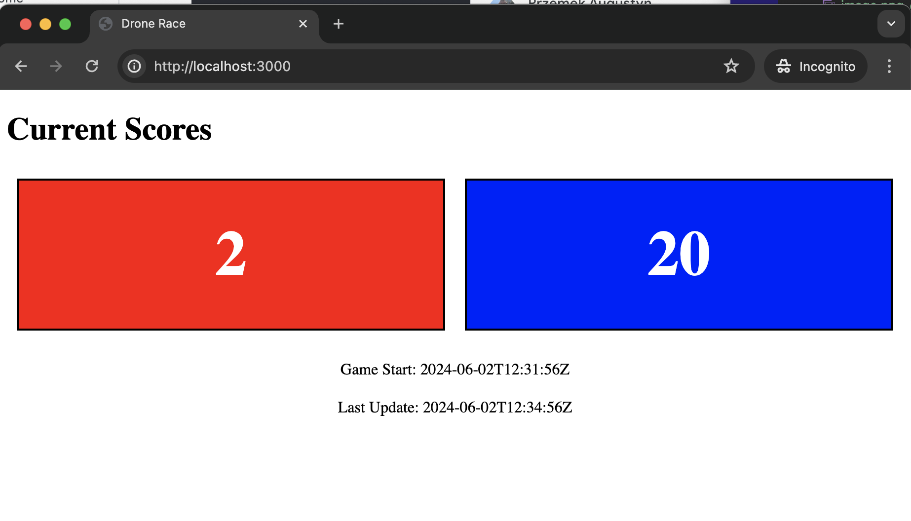

# Data exchange

Python process responsible for communication with beacons generates the following JSON file.

```json
{
    "red": 2,
    "blue": 20,
    "gameStart": "2024-06-02T12:31:56Z",
    "lastUpdate": "2024-06-02T12:34:56Z"
}
```

NodeJS is monitoring the file (every 1s) and if there is a change in the content it will send it over web socket to the client, which will update the UI.


# Start server

```bash
node server.js
```


